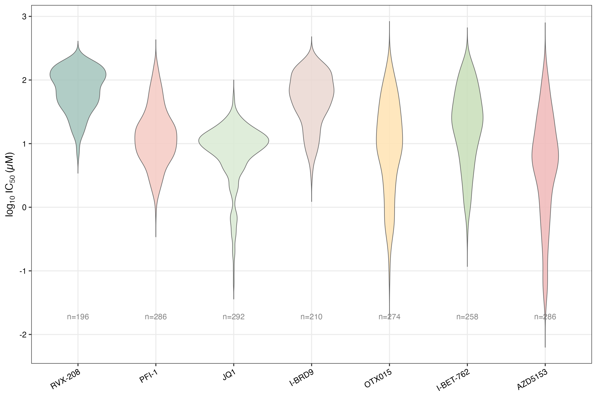
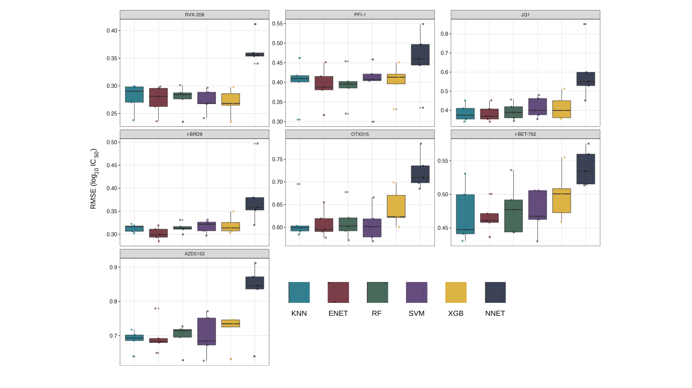
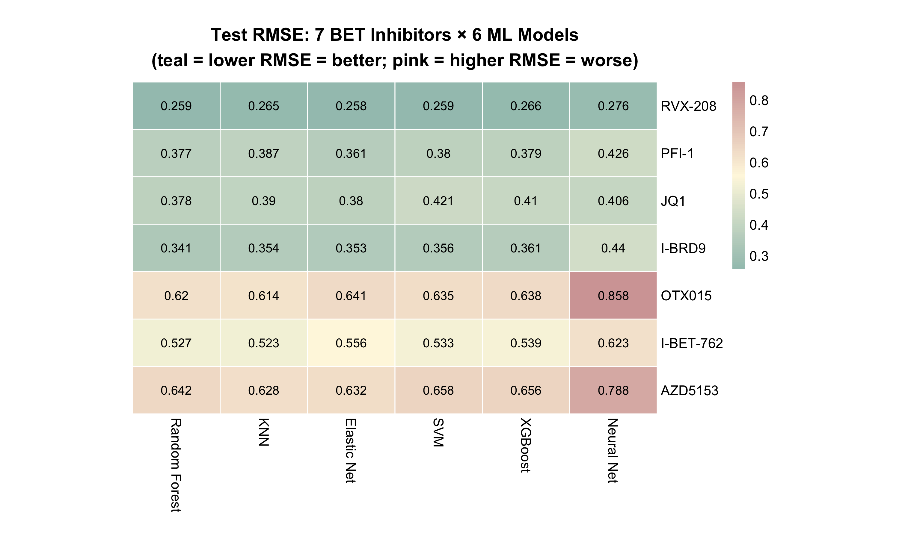
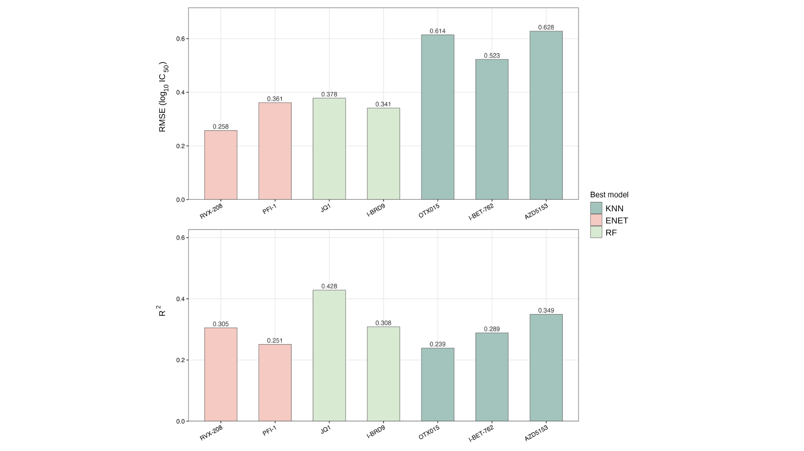
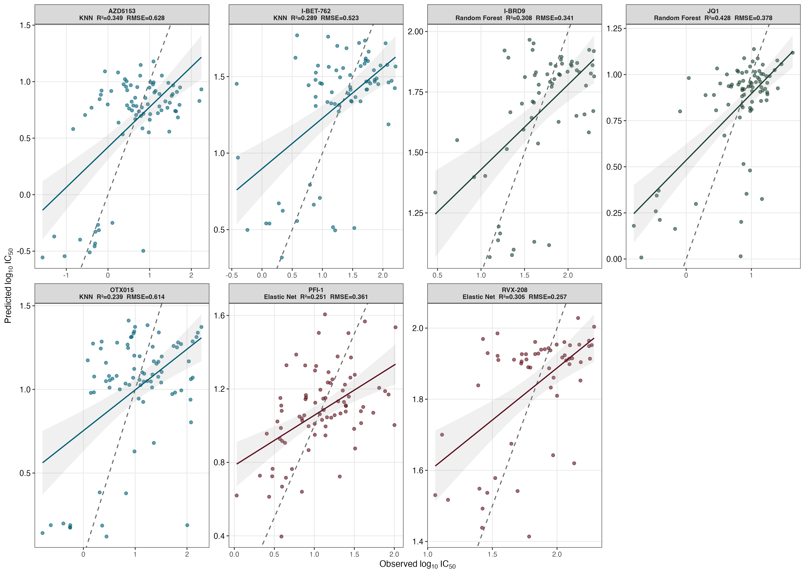
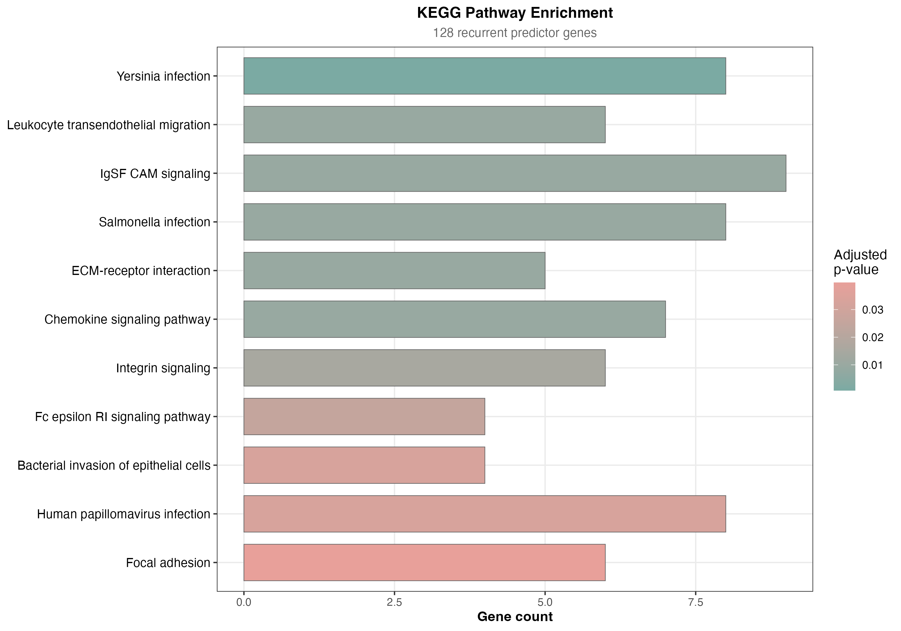
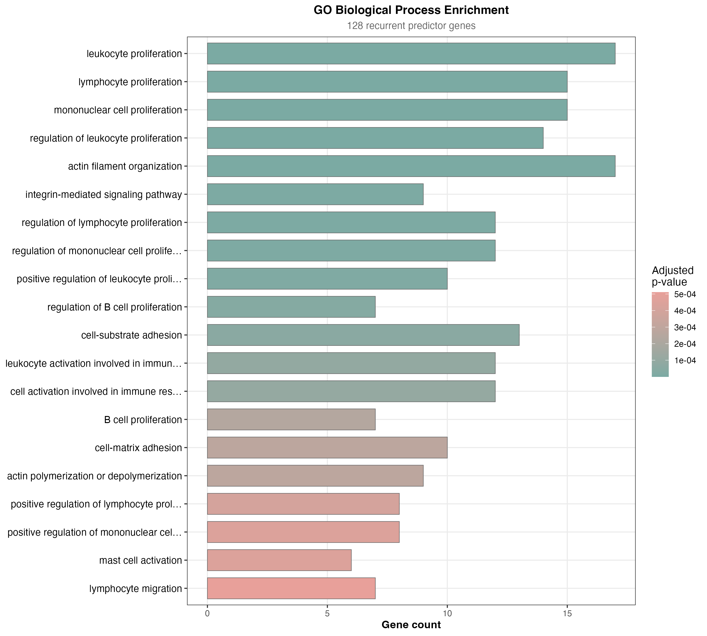

# BET-ML-IC50 

> Systematic, drug-specific benchmark of six machine learning algorithms for predicting BET-family bromodomain inhibitor sensitivity (IC50) from baseline gene expression across **415 cancer cell lines** and **7 inhibitors**, with permutation-based interpretation and KEGG/GO pathway enrichment.

[](https://opensource.org/licenses/MIT)
[](https://www.r-project.org/)
[](https://www.cancerrxgene.org/)
[](https://www.ncbi.nlm.nih.gov/geo/query/acc.cgi?acc=GSE36133)

---

## Table of Contents

- [Highlights](#highlights)
- [Data](#data)
- [Methods](#methods)
- [Results](#results)
- [Repository Structure](#repository-structure)
- [Requirements](#requirements)
- [Reproducing the Analysis](#reproducing-the-analysis)
- [Figures](#figures)
- [Citation](#citation)
- [License](#license)
- [Contact](#contact)

---
## Highlights

- **Drug-specific model selection beats one-size-fits-all.** KNN wins for 3 drugs, elastic net for 2, random forest for 2.
- **Random forest is the most robust default**, ranking in the top three for all seven inhibitors.
- **JQ1** is the most predictable response (R² = 0.428); **OTX015** is the most challenging (R² = 0.239).
- Permutation feature importance + pathway enrichment **recovers the established clinical biology of BET inhibition** (leukocyte/lymphocyte proliferation, actin cytoskeleton organization) without any prior pathway knowledge.
- Fully nested **5×5 cross-validation** with the **1-SE rule** across 126 configurations (7 drugs × 6 models × 3 feature-set sizes).
- Reproducible pipeline of **12 modular R scripts** under the MIT license.

---

## Data

| Source | Content | Use |
|---|---|---|
| **CCLE** (Barretina et al., 2012) | Gene-level mRNA expression for 918 cancer cell lines (18,926 genes) | Predictor matrix (curated to 415 cell lines, 18,479 mapped via `org.Hs.eg.db` v3.23.1) |
| **GDSC** (Iorio et al., 2016; Yang et al., 2012) | IC50 values (µM) for 7 bromodomain inhibitors | Response variable |

**Per-drug sample sizes after IC50 < 200 µM filtering and partitioning (Table 1 in the paper):**

| Drug | GDSC records | Retained | % | Train | Test | Validation |
|---|---:|---:|---:|---:|---:|---:|
| RVX-208 | 727 | 279 | 67.2 | 196 | 56 | 27 |
| PFI-1 | 927 | 406 | 97.8 | 286 | 80 | 40 |
| JQ1 | 911 | 415 | 100.0 | 292 | 83 | 40 |
| I-BRD9 | 752 | 298 | 71.8 | 210 | 60 | 28 |
| OTX015 | 728 | 390 | 94.0 | 274 | 80 | 36 |
| I-BET-762 | 727 | 366 | 88.2 | 258 | 72 | 36 |
| AZD5153 | 727 | 406 | 97.8 | 286 | 80 | 40 |

**Compound profile:** JQ1, OTX015, I-BET-762, AZD5153 are BET inhibitors; PFI-1 is a BET chemical probe; RVX-208 is BD2-selective; **I-BRD9 selectively targets BRD9 (non-BET) and serves as a comparator**.

---

## Methods

### Preprocessing
- Drug-specific pipelines (no leakage across compounds).
- IC50 < 200 µM retention (bioassay validity).
- log10 transformation of IC50.
- Stratified train/test/validation split on quartile-binned IC50 via `caret::createDataPartition()`.
- Min–max [0, 1] rescaling of expression features; **scaler fit on training set only** to prevent leakage.
- Filter feature selection: top-50/100/150 genes by absolute Pearson correlation with log10 IC50.

### Algorithms and hyperparameter grids (Table 2)

| Model | R Package | Hyperparameter grid |
|---|---|---|
| KNN | `kknn` 1.4.1 | `kmax ∈ {3,5,…,35}`, `distance ∈ {1,2}`, kernel ∈ {rectangular, triangular, epanechnikov, gaussian} |
| Elastic Net | `elasticnet` 1.3 | `λ ∈ {0.0,…,1.0}`, `fraction ∈ {0.1,…,1.0}` |
| Neural Net | `nnet` 7.3-20 | `size ∈ {1,3,5}`, `decay ∈ {0, 0.001, 0.01}`, `maxit = 500` |
| SVM (RBF) | `kernlab` 0.9-33 | `C ∈ {2⁻²,…,2⁵}`, `σ ∈ {2⁻⁵,…,2²}` |
| XGBoost | `xgboost` 3.2.0.1 | `η ∈ {0.05, 0.1, 0.3}`, `max_depth ∈ {3,5,7}`, subsample/colsample ∈ {0.7, 1.0}, `min_child ∈ {1,3}`, `γ ∈ {0, 0.1}` |
| Random Forest | `randomForest` 4.7-1.2 | `mtry ∈ {√p, p/3, p/5, p/2}`, `ntree = 500` |

### Model selection
- Fully nested **5×5 cross-validation** across 126 configurations (7 drugs × 6 models × 3 feature-set sizes).
- **1-SE rule** chooses the smallest feature set whose mean RMSE is within one SE of the best.
- Statistical comparisons: Friedman test with paired Wilcoxon signed-rank post-hoc tests under Bonferroni correction.

### Metrics
- **RMSE** (primary), **MAE**, **R²** — all computed in log10 space.

### Interpretation
- **Permutation feature importance** (10 shuffles per gene) on the held-out test set.
- Top-10 genes per drug-model pair → union across 42 pairs → **128 recurrent predictor genes**.
- **KEGG** and **GO BP** over-representation analysis with `clusterProfiler`, Benjamini–Hochberg correction.

---

## Results

### Cross-validated performance and feature-set selection

The 1-SE rule favored the smallest feature set (50 genes) in **38 of 42 drug–model pairs (90.5%)**. XGBoost preferred 150 genes for several drugs, suggesting gradient-boosted trees benefit from a larger feature pool here.



**Figure 2.** Log10-transformed IC50 distributions of the seven bromodomain inhibitors. BET inhibitors (PFI-1, JQ1, OTX015, I-BET-762, AZD5153) concentrate at lower IC50 values; RVX-208 and I-BRD9 at higher values, consistent with their selective profiles.



**Figure 3.** Distribution of RMSE across the five outer CV folds for each drug–model pair using the 1-SE-selected feature set. NNET shows the widest and highest RMSE; RF, KNN, and ENET show the most consistent performance.

### Test-set performance is drug-specific



**Figure 4.** Test-set RMSE for every drug × model cell (green = better, red = worse). RVX-208, PFI-1, JQ1, and I-BRD9 are easier to predict; OTX015, I-BET-762, AZD5153 are harder. NNET ranks last for all seven drugs.



**Figure 5.** RMSE and R² of the best-performing model per drug on the 20% held-out test set.

**Best-performing model per drug (Table 3):**

| Drug | Best Model | Genes | RMSE | MAE | R² |
|---|---|---:|---:|---:|---:|
| RVX-208 | Elastic Net | 50 | 0.258 | 0.211 | 0.305 |
| PFI-1 | Elastic Net | 100 | 0.361 | 0.289 | 0.251 |
| **JQ1** | **Random Forest** | **50** | **0.378** | **0.285** | **0.428** |
| I-BRD9 | Random Forest | 50 | 0.341 | 0.265 | 0.308 |
| OTX015 | KNN | 100 | 0.614 | 0.509 | 0.239 |
| I-BET-762 | KNN | 50 | 0.523 | 0.396 | 0.289 |
| AZD5153 | KNN | 50 | 0.628 | 0.492 | 0.349 |



**Figure 6.** Predicted vs observed log10 IC50 on the test set for the best model per drug. JQ1 (RF, R² = 0.428) shows the tightest agreement; OTX015 (KNN, R² = 0.239) shows the highest residual variance.

### Recurrent predictive genes

Permutation importance identified **128 unique high-importance genes** across 42 drug–model pairs. **16 genes** appeared in **≥ 8** pairs, spanning three coherent themes: immune/hematopoietic regulation (TASL, WAS, ITGAL, IL13RA1, TRAF3IP3), oncogenic signaling (GNA11, AMOTL2, CTTN, P2RY8), and cell-surface/adhesion machinery (TSPAN6, LRP11, TJP1). Notably, **BRD2/3/4 and MYC mRNA did not appear among top features** — discussed below.

**Top-15 recurrent universal predictor genes (Table 4):**

| Gene | Appearances | Drugs | Models | Mean Importance | Function |
|---|---:|---:|---:|---:|---|
| GNA11 | 16 | 5 | 6 | 0.020 | G-protein α-subunit; uveal melanoma oncogene |
| TSPAN6 | 14 | 6 | 6 | 0.006 | Tetraspanin; membrane organization |
| AMOTL2 | 12 | 5 | 5 | 0.021 | Hippo/YAP–TAZ regulator |
| LRP11 | 12 | 4 | 5 | 0.010 | LDL receptor family; lipid trafficking |
| TASL | 11 | 5 | 6 | 0.013 | TLR7/8 signaling adapter; immune |
| TSPOAP1-AS1 | 10 | 5 | 5 | 0.022 | Long non-coding RNA |
| WAS | 10 | 3 | 6 | 0.017 | Wiskott-Aldrich; actin polymerization |
| ITGAL | 9 | 6 | 5 | 0.013 | Integrin α-L (LFA-1); leukocyte adhesion |
| KBTBD8 | 9 | 3 | 6 | 0.009 | BTB-domain ubiquitin adaptor |
| IL13RA1 | 8 | 5 | 4 | 0.008 | IL-13 receptor α; cytokine signaling |
| SNX7 | 8 | 3 | 6 | 0.009 | Sorting nexin; intracellular trafficking |
| TRAF3IP3 | 8 | 3 | 4 | 0.021 | T-cell receptor signaling |
| CTTN | 7 | 4 | 3 | 0.005 | Cortactin; cell invasion, metastasis |
| P2RY8 | 7 | 4 | 4 | 0.014 | P2Y receptor; B-cell lymphoma |
| TJP1 | 6 | 4 | 4 | 0.039 | Tight junction protein; epithelial |

### Pathway enrichment recovers BET-inhibitor biology



**Figure 7.** 11 KEGG pathways enriched at q < 0.10. Themes: leukocyte trafficking, cytoskeleton remodeling, and cell adhesion. The pathogen-labelled pathways (Yersinia, Salmonella, bacterial invasion) reflect the host actin/integrin/phagocytosis machinery these pathogens exploit — **not microbial relevance**.



**Figure 8.** GO Biological Process enrichment is dominated by **leukocyte proliferation (p = 2.5 × 10⁻¹¹, 17 genes)**, lymphocyte proliferation (p = 3.5 × 10⁻¹⁰), mononuclear cell proliferation, regulation of leukocyte proliferation, and actin filament organization — directly consistent with the established clinical activity of BET inhibitors in hematological malignancies.

### Computational cost

Full nested CV pipeline ran in **~10 h on Apple Silicon**. Final model training: **0.033 s (SVM) – 0.509 s (RF)**. Inference: **sub-millisecond** for all models.

---

## Repository Structure

```
.
├── README.md
├── LICENSE
├── figures/                # All publication figures (Figure 1–8)
├── data/
│   ├── raw/                # GEO/CCLE expression + GDSC IC50 (not redistributed)
│   └── processed/          # Curated 415-cell-line matrix
├── R/                      # 12 modular pipeline scripts
│   ├── 01_load_data.R
│   ├── 02_preprocess.R
│   ├── 03_feature_selection.R
│   ├── 04_nested_cv.R
│   ├── 05_train_final_models.R
│   ├── 06_evaluate.R
│   ├── 07_permutation_importance.R
│   ├── 08_pathway_enrichment.R
│   ├── 09_figures.R
│   ├── 10_tables.R
│   ├── 11_supplementary.R
│   └── 12_reporting.R
└── results/
    ├── models/
    ├── importance/
    └── enrichment/
```

> Update this section to match the final repository layout when publishing.

---

## Requirements

- **R** 4.5.0 or later
- Core packages: `caret`, `kknn`, `elasticnet`, `nnet`, `kernlab`, `xgboost`, `randomForest`
- Annotation & enrichment: `org.Hs.eg.db` (v3.23.1), `clusterProfiler`
- Utilities: `tidyverse`, `data.table`, `ggplot2`

Install (example):

```r
install.packages(c("caret", "kknn", "elasticnet", "nnet", "kernlab",
                   "xgboost", "randomForest", "tidyverse", "data.table"))

if (!require("BiocManager", quietly = TRUE)) install.packages("BiocManager")
BiocManager::install(c("org.Hs.eg.db", "clusterProfiler"))
```

---

## Reproducing the Analysis

```bash
git clone https://github.com/<user>/BET-ML-IC50.git
cd BET-ML-IC50

# Execute the full pipeline (≈ 9–13 hours on a modern workstation)
Rscript R/01_load_data.R
Rscript R/02_preprocess.R
Rscript R/03_feature_selection.R
Rscript R/04_nested_cv.R
Rscript R/05_train_final_models.R
Rscript R/06_evaluate.R
Rscript R/07_permutation_importance.R
Rscript R/08_pathway_enrichment.R
Rscript R/09_figures.R
Rscript R/10_tables.R
```

Set a global seed at the top of `01_load_data.R` to reproduce splits exactly.

---

## Figures

All figures used in the manuscript are included in [`figures/`](figures/):

| # | File | Description |
|---:|---|---|
| 1 | `figures/figure1.png` | Study design and analysis pipeline |
| 2 | `figures/figure2.png` | Log10-transformed IC50 distributions of seven bromodomain inhibitors |
| 3 | `figures/figure3.png` | Cross-validation RMSE distribution across outer folds for each drug–model pair |
| 4 | `figures/figure4.png` | Test RMSE heatmap across seven inhibitors × six ML algorithms |
| 5 | `figures/figure5.png` | Test-set performance (RMSE and R²) of the best-performing model per drug |
| 6 | `figures/figure6.png` | Predicted vs observed log10 IC50 for each drug's best model |
| 7 | `figures/figure7.png` | KEGG pathway over-representation of the 128 recurrent predictor genes |
| 8 | `figures/figure8.png` | GO Biological Process enrichment of recurrent predictor genes |

---
## Folder Structure

```
Gizem_yl/
├── README.md                          ← this file
├── README_TR.md                       ← Turkish version
├── GeneExp.csv                        ← gene expression matrix (input)
├── RVX-208.xls, PFI-1.xls, ...        ← drug-specific IC50 data (7 files)
├── id_to_symbol_mapping.csv           ← Entrez ID → gene symbol mapping
├── gene_data_translated.RData         ← preprocessed gene expression (with symbols)
├── ALL_DRUGS_TEST_SUMMARY.csv         ← main results table (6 models × 7 drugs)
├── ALL_DRUGS_GENE_SELECTION.csv       ← 1-SE rule decisions
│
├── scripts/                           ← all R scripts (modular)
│   ├── 00_setup.R                     ← libraries, paths, constants
│   ├── 00_RUN_ALL.R                   ← master script (runs everything)
│   ├── 01_load_data_and_translate.R   ← Entrez ID → gene symbol conversion
│   ├── 02_preprocess_per_drug.R       ← merge, filter, split, normalize, FS
│   ├── 03_run_nested_cv.R             ← nested CV for all models (LONG)
│   ├── 04_statistical_tests.R         ← Friedman, Wilcoxon, 1-SE
│   ├── 05_train_final_models.R        ← train final models per drug
│   ├── 06_test_and_validate.R         ← test set evaluation + val predictions
│   └── 07_visualize.R                 ← 5 publication figures + 4 tables
│
├── figures/                           ← generated by 07_visualize.R
│   ├── Figure2_test_performance_bars.png
│   ├── Figure3_heatmap.png
│   ├── Figure4_scatter_predictions.png
│   ├── Figure5_fold_boxplots.png
│   ├── Figure6_feature_importance.png
│   ├── Table_main1_best_model_per_drug.csv
│   ├── Table_S1_full_test_performance.csv
│   ├── Table_S2_gene_selection.csv
│   └── top_genes_per_drug.csv
│
└── {DRUG}/                            ← one folder per drug (7 total)
    ├── data_train_50.csv, data_test_50.csv, data_val_50.csv  (12 CSVs)
    ├── ...
    ├── results/                       ← drug-specific outputs
    │   ├── knn_results.csv, ..., rf_results.csv  (per-model summaries)
    │   ├── fold_details_all_models.csv          (raw nested CV)
    │   ├── friedman_test.csv, wilcoxon_pairwise.csv
    │   ├── final_gene_selection.csv             (1-SE decisions)
    │   ├── test_performances.csv                (final test metrics)
    │   └── validation_IC50_predictions.csv      (predictions on val set)
    └── models/                        ← trained final models
        ├── model_knn.RData, ..., model_rf.RData
        └── model_xgb.json
```

## Requirements

- **R version:** 4.0 or higher (developed on R 4.5.0)
- **Operating system:** macOS, Linux, or Windows
- **RAM:** ≥8 GB recommended
- **Disk:** ~500 MB for results and models

### Required R packages

**CRAN packages:**
```r
install.packages(c("readxl", "dplyr", "tidyr", "caret", "class",
                   "Metrics", "elasticnet", "nnet", "kernlab",
                   "xgboost", "kknn", "randomForest", "ggplot2",
                   "scales", "RColorBrewer", "pheatmap", "viridis"))
```

**Bioconductor packages** (for gene symbol annotation):
```r
if (!require("BiocManager")) install.packages("BiocManager")
BiocManager::install(c("org.Hs.eg.db", "AnnotationDbi"))
```

## How to Run

### Option 1 — Run everything at once

```r
setwd("path/to/Gizem_yl/scripts")
source("00_RUN_ALL.R")
```

⏱️ Total runtime: **10–14 hours** (mostly nested CV in script 03).

### Option 2 — Run scripts individually (recommended for first time)

```r
setwd("path/to/Gizem_yl/scripts")
source("00_setup.R")                       # ~30 sec
source("01_load_data_and_translate.R")     # ~2 min
source("02_preprocess_per_drug.R")         # ~5 min
source("03_run_nested_cv.R")               # ~9-13 hours (LONG)
source("04_statistical_tests.R")           # ~10 sec
source("05_train_final_models.R")          # ~10 min
source("06_test_and_validate.R")           # ~2 min
source("07_visualize.R")                   # ~5 min
```

### Important — before starting

1. **Update `BASE_PATH`** in `00_setup.R` to match your local path:
   ```r
   BASE_PATH <- "/Users/yourname/Desktop/Gizem_yl/"
   ```

2. **Disable sleep mode** if running script 03 overnight:
   - macOS: System Settings → Battery → Prevent automatic sleeping
   - Windows: Power & Sleep → Never

3. **Keep your computer plugged in** for the full nested CV run.

## Reproducibility Guarantees

- **Identical results across runs:** All `set.seed()` calls are deterministic. The same input data + same code produces identical output (we verified this).
- **Version stability:** R `4.5.0` was used. Other versions may produce slightly different results due to RNG changes — pin your R version with `renv` if exact reproducibility is critical.
- **Cross-platform:** Tested on macOS. Should work on Linux/Windows with the same package versions.

## Citation

If you use this code or data, please cite:

> [Author names]. *[Paper title]*. [Journal name], [Year]. DOI: [10.xxxx/xxxx]

```bibtex
@article{tutkun2026bet,
  title={...},
  author={Tutkun, Gizem and ...},
  journal={...},
  year={2026},
  doi={10.xxxx/xxxx}
}
```

## Contact

**Gizem Tutkun**
Medical Biotechnology - Akdeniz University
[gizemtutkun17@gmail.com] · [https://orcid.org/0000-0002-6184-4974]

## License

The R code in this repository is released under the **MIT License** — you are free to use, modify, and redistribute it, provided you include the original copyright notice. See the [`LICENSE`](LICENSE) file for full terms.

**Data files** (`GeneExp.csv` and the seven `*.xls` files) are derived from publicly available sources, primarily [Genomics of Drug Sensitivity in Cancer (GDSC) / CancerRxGene](https://www.cancerrxgene.org/). These data files are **not** covered by the MIT License and are subject to their original sources' terms of use. If you intend to redistribute the data, please consult the original source.

## Acknowledgments

- **CancerRxGene/GDSC** — for the cell line drug sensitivity data
- **R caret, xgboost, randomForest** maintainers — for the ML implementations
- **Bioconductor** — for `org.Hs.eg.db` annotation database

---

*Last updated: May 2026*
